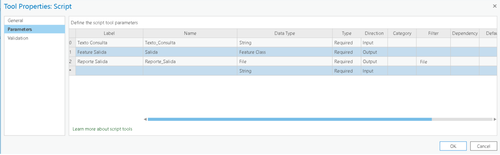
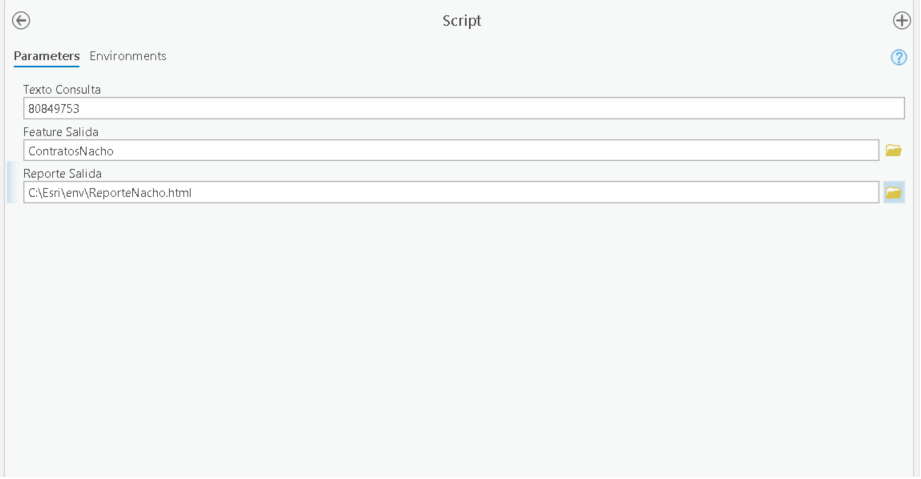
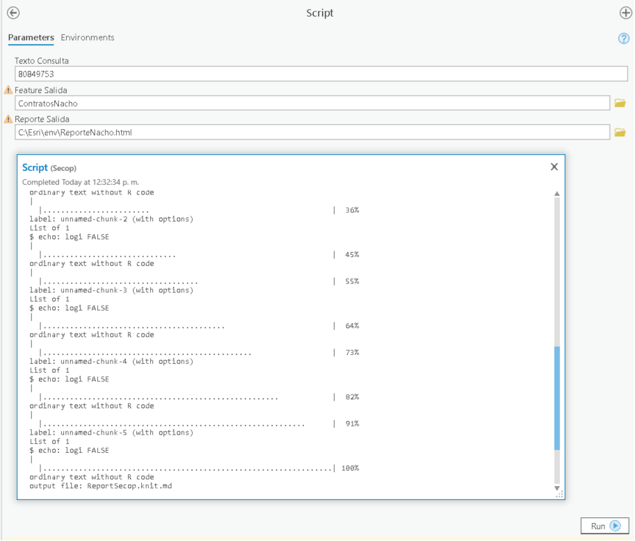
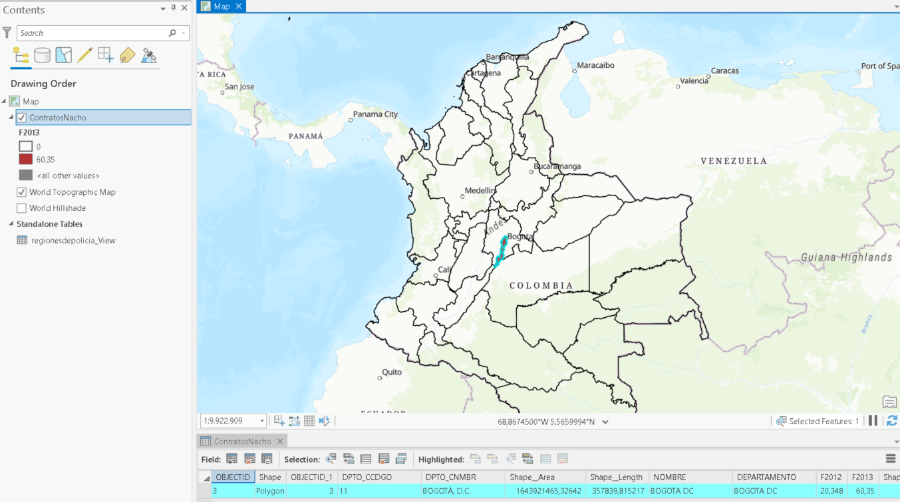
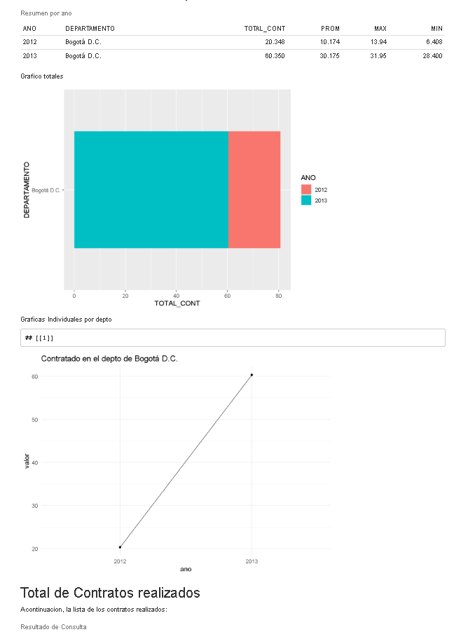

# Secop Explorer

Esta herramienta sirve para explorar el dataset de [SECOP](https://www.datos.gov.co/Gastos-Gubernamentales/SECOP-I/nuxh-53y2) que se encuentra en el portal de [datos abiertos](datos.gov.co), con el fin de hacer hacer estadísticas por departamento y municipio. 

### Instrucciones de instalacion:

- Descargue el repositorio en la carpeta fija dentro del directorio `c:\esri\r-arcgis-bridge-col-demo` Si tiene git instalado ejecute los siguientes comandos

```
cd c:\
mkir esri
cd esri
git clone https://github.com/EsriColombia/r-arcgis-tools.git
cd r-arcgis-tools/datasets
unzip colombia.gdb.zip

```

Puede ejecutar el script R-Secop-Step-By-Step.R para comprobar funcionalidad

### Creacion de herramienta de geoprocesamiento

- Inicie una sesión de arcgis Pro.

- Cree una herramienta de geoprocesamiento a partir de un Script.


- Agregue el script de R desde el directorio donde está el script y nombre la herramienta.


- En el parametro Name, nómbrelo como **SecopExplorer**, en Label:  **Explora datos del portal de datos abiertos de Secop**, y las demás opciones, las que vienen por defecto, en la pestaña parametros 
llene los parámetros de la siguiente manera: 

- Parametro 0: Ano de Consulta - String - Entrada
- Parametro 1: Feature de Salida - FeatureClass - Salida
- Parametro 2: Reporte de Salida - File - Salida - Filter (html)




- Pruebe la herramienta ejecutandola directamente en ArcgisPro:





- Verifique el resultado y ajuste la simbologia del feature class de salida clasificando el resultado por la columna del año que le interese



